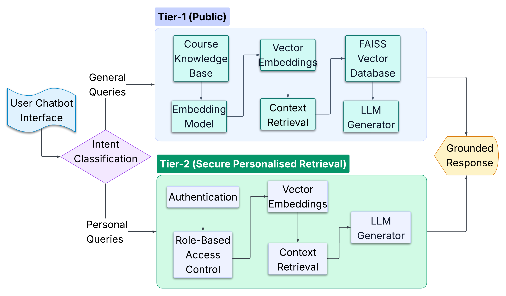
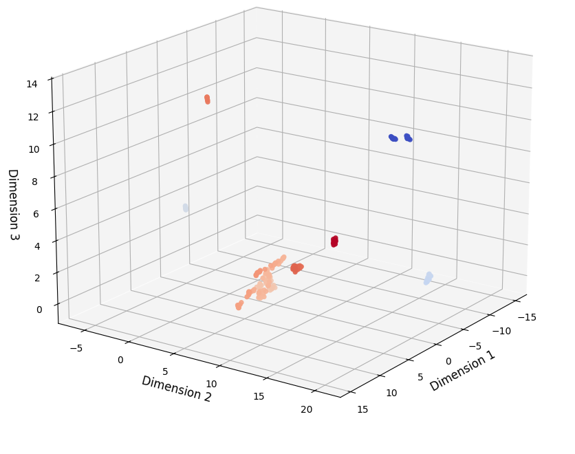
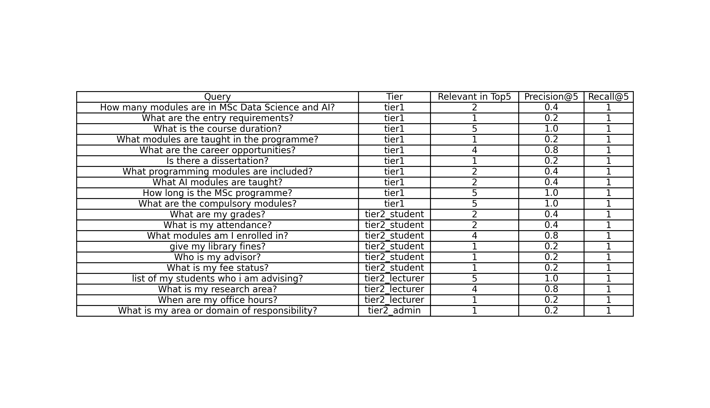

# 🎓 Two-Tier Retrieval-Augmented Chatbot for University Student Support

**MSc Dissertation Project — University of Hull**

A secure Retrieval-Augmented Generation (RAG) chatbot designed to provide both public university information and personalised academic support through a two-tier retrieval architecture. The system combines semantic search, vector databases, role-based access control (RBAC), and Large Language Models to deliver accurate, context-aware, and secure responses.

---

## 📊 Project Highlights

| Area                | Technology                       | Key Result                             |
| ------------------- | -------------------------------- | -------------------------------------- |
| Semantic Retrieval  | BGE-Large Embeddings + FAISS     | Recall@5 = 1.00                        |
| RAG Architecture    | Two-Tier Retrieval System        | Public + Secure Personalised Retrieval |
| Security            | Role-Based Access Control (RBAC) | Zero Unauthorized Access               |
| Query Routing       | Intent Classification Pipeline   | Automatic Tier Selection               |
| Response Generation | Llama 3.1                        | Context-Aware Responses                |
| Performance         | Optimised Vector Search          | Tier-1 Response Time: 0.62s            |

---

## 🚀 Project Overview

Universities manage large volumes of academic information including course details, regulations, assessments, attendance records, grades, and administrative services.

Traditional chatbot systems often struggle with:

* Inaccurate responses
* Hallucinations
* Lack of contextual understanding
* Limited personalisation
* Security concerns surrounding sensitive student data

This project addresses these challenges through a secure two-tier Retrieval-Augmented Generation (RAG) architecture that separates public information retrieval from personalised academic data retrieval.

---

## 🏗️ System Architecture

The solution uses a two-tier retrieval framework:

### Tier 1 — Public Information Retrieval

Provides access to:

* Course information
* Programme structures
* Entry requirements
* Module details
* Academic regulations

### Tier 2 — Secure Personalised Retrieval

Provides access to:

* Student grades
* Attendance records
* Fee status
* Academic advisors
* Lecturer advisee information

All personalised queries are protected through Role-Based Access Control (RBAC).


---

## 🔄 Query Routing Pipeline

User queries are automatically classified and routed to the appropriate retrieval engine.

### Workflow

1. User submits a query
2. Intent Classification determines query type
3. Query routed to Tier-1 or Tier-2
4. FAISS retrieves relevant context
5. RBAC validation performed
6. Llama 3.1 generates grounded response



---

## 🔍 Retrieval-Augmented Generation Pipeline

### Knowledge Base Construction

Public Knowledge Base:

* Undergraduate Programmes
* Postgraduate Programmes
* PhD Information

Personalised Knowledge Base:

* Student Records
* Lecturer Information
* Administrative Data

### Semantic Search Stack

* BAAI BGE-Large Embeddings
* FAISS Vector Database
* Cosine Similarity Search
* Top-K Context Retrieval

### LLM Layer

* Llama 3.1
* Context-Grounded Generation
* Reduced Hallucination Risk

---

## 🧠 Embedding Space Visualisation

To validate semantic representation quality, UMAP dimensionality reduction was applied to visualise embedding clusters.

The visualisation demonstrates meaningful grouping of semantically related academic content within vector space.



---

## 📈 Retrieval Performance Evaluation

The system was evaluated using:

* Precision@5
* Recall@5
* Response Relevance
* Retrieval Accuracy

### Key Findings

* Recall@5 consistently achieved 1.00
* Public information retrieval achieved higher precision
* Personalised retrieval maintained strong relevance while enforcing security constraints



---

## ⚡ Response Time Analysis

System latency was measured across different retrieval scenarios.

| Query Type             | Response Time |
| ---------------------- | ------------- |
| Public Information     | 0.618s        |
| Student Queries        | 8.775s        |
| Administrative Queries | 2.615s        |
| Lecturer Queries       | 54.718s       |

### Observation

Tier-1 retrieval demonstrates significantly faster response times due to the absence of authentication and access-control overhead.


---

## 🔐 Security & Access Control

A Role-Based Access Control (RBAC) framework was implemented to ensure that users can only access authorised information.

### Access Policy

| Role        | Access Scope               |
| ----------- | -------------------------- |
| Student     | Own Academic Records       |
| Lecturer    | Assigned Advisee Students  |
| Admin       | Administrative Information |
| Public User | Programme Information      |

### Security Validation

The system successfully prevented unauthorised access while maintaining retrieval effectiveness.

Examples:

✅ Student can view own grades

✅ Lecturer can view advisee information

✅ Admin cannot access academic advisor information

✅ Public users cannot access personal records


---

## 💻 System Demonstration

The chatbot interface integrates:

* Query Processing
* Semantic Retrieval
* Access Validation
* Context Generation
* Secure Response Delivery

The application supports both public and authenticated user interactions through a unified conversational interface.


---

## 🛠️ Technology Stack

### Artificial Intelligence & NLP

`Llama 3.1`
`RAG`
`Prompt Engineering`

### Semantic Retrieval

`FAISS`
`BGE-Large Embeddings`
`Sentence Transformers`

### Machine Learning

`Scikit-Learn`
`UMAP`

### Data Processing

`Pandas`
`NumPy`

### Security

`RBAC`
`Authentication Layer`

### Development

`Python`
`Jupyter Notebook`

---

## 📂 Repository Structure

```text
├── 2-tier Rag based Chatbot.ipynb
├── Harshaa_Hariharan_Dissertation_Report.pdf
├── README.md
├── requirements.txt
│
└── Visuals/
    ├── 2 tier architecture.jpg
    ├── architecture.png
    ├── Interface Screenshot.png
    ├── rag_evaluation_results.png
    ├── response time evaluation.png
    ├── role based access evaluation.png
    └── umap_embeddings.png
```

---

## 🎯 Key Achievements

✅ Designed and implemented a Two-Tier RAG architecture

✅ Built a secure personalised retrieval system using RBAC

✅ Implemented semantic search using BGE embeddings and FAISS

✅ Achieved Recall@5 of 1.00 across evaluation queries

✅ Reduced hallucination risk through retrieval-grounded generation

✅ Developed an end-to-end AI application combining NLP, Retrieval Systems, Security, and LLMs

---

## 🙋‍♀️ Author

**Harshaa Hariharan**

MSc Data Science & Artificial Intelligence

Machine Learning Engineer | AI Engineer | Data Scientist

LinkedIn: https://www.linkedin.com/in/harshaa-harshini

GitHub: https://github.com/Harshaa329

Portfolio : https://harshaa329.github.io
